# Интеллектуальная аналитическая система тактико-технических характеристик гражданских БПЛА

Программный комплекс разработан в рамках магистерской диссертации (Московский авиационный институт, Институт №8, 2026 г.) по направлению подготовки 02.04.02 «Фундаментальная информатика и информационные технологии» (программа «Искусственный интеллект и суперкомпьютерные технологии»).

Разработчик: студент группы М8О-214СВ-24 Красавин Максим Алексеевич

Научный руководитель: к.т.н., Ухов Пётр Александрович

---

## Обзор системы и актуальность проекта

В условиях стремительного масштабирования рынка гражданских беспилотных авиационных систем (БАС) и реализации национального проекта «Беспилотные авиационные системы» в РФ, перед аналитиками, инженерами и службами закупок стоит острая проблема информационной перегрузки. Номенклатура доступных беспилотных платформ исчисляется сотнями моделей, а их тактико-технические характеристики (ТТХ) сильно фрагментированы и публикуются в неструктурированных форматах.

**Ключевое противоречие**, которое разрешает данная система:
* **Маркетинговые данные («заводские спецификации»):** декларируются производителями для идеализированных стендовых условий (отсутствие ветра, температура +20°C, висение без маневров на уровне моря).
* **Эксплуатационная реальность:** в условиях реальных полетных миссий (ветер, отрицательные температуры, деградация АКБ) фактическое полетное время снижается, что создает риски срыва критически важных задач или утери дорогостоящего оборудования.

**Данная система** — это гибридный аналитический конвейер, который объединяет предиктивные возможности моделей машинного обучения с детерминированной логикой методов многокритериального выбора принятия решений. Система **осуществляет ранжирование и подбор БПЛА не на основе рекламных буклетов, а на базе прогнозируемых реалистичных характеристик**, обеспечивая при этом полную прозрачность алгоритмов за счет объяснимого ИИ.

---

## Научная новизна

При недостатке телеметрических данных из открытых источников возникла необходимость как-то сформировать целевую переменную `Actual_Flight_Time_min`, которая бы могла в себе учитывать штрафы за различные погодные условия и другие внешние факторы, поэтому в модуле [data_generator.py](https://github.com/TurboBrumbo/MAI_Masters_thesis_2026/blob/main/src/data_generator.py) используется несколько подходов для введения "шума" во время полёта, в основе которой лежит **теория импульса для идеального несущего винта**:
1. Теоретическая мощность висения ($P$):
$$P = \frac{1}{\eta} \cdot \left( 4 \cdot T \sqrt{\frac{T}{2 \rho A}} \right)$$
Где $T$ — тяга на один мотор (вес БПЛА $\cdot g / 4$), $\rho$ — плотность воздуха ($1.225 \text{ кг/м}^3$), $A$ — ометаемая площадь одного винта, $\eta$ — базовая эффективность ($0.85$).
2. Аэродинамические и погодные штрафы: влияние ветра моделируется кубической зависимостью: $1 + 0.05v + 0.002v^3$.
3. Влияние температуры: эмпирические коэффициенты деградации LiPo батареи при температуре $< 15^\circ\text{C}$ или $> 35^\circ\text{C}$.
4. Итоговое время: энергия батареи ($E = V \cdot I$) делится на скорректированную мощность.

---

## Архитектура программного комплекса

Программный комплекс построен на принципах объектно-ориентированного программирования (ООП), модульности и слабой связанности компонентов. 

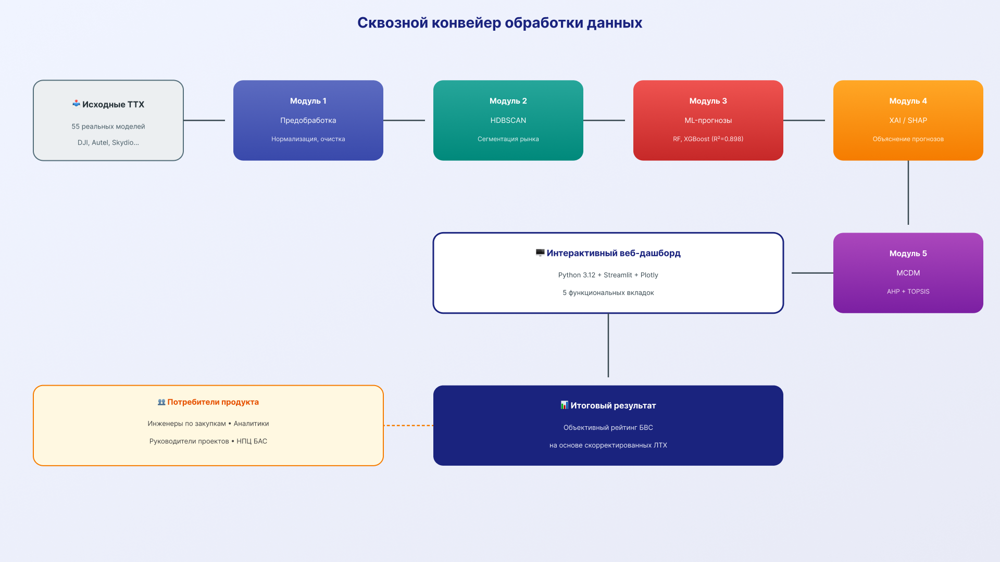

### Структура модулей (папка `src/`):
1. **[data_generator.py](https://github.com/TurboBrumbo/MAI_Masters_thesis_2026/blob/main/src/data_generator.py) (физико-математический генератор):** реализует физически обоснованную модель расчёта теоретической мощности висения на основе теории импульса ($P = \frac{(mg)^{1.5}}{\sqrt{2\rho A}}$) и вводит аэродинамические штрафы за погодные условия (скорость ветра, температура воздуха), используется для генерации синтетических выборок, расширяющих реальный датасет.
2. **[preprocessing.py](https://github.com/TurboBrumbo/MAI_Masters_thesis_2026/blob/main/src/preprocessing.py) (конвейер предобработки):** выполняет очистку данных, обработку пропусков (медианная импутация), фильтрацию стохастических выбросов (по методу Z-score) и адаптивное масштабирование признаков (Standard/MinMax/Robust Scaling) для корректной работы метрических алгоритмов.
3. **[clustering.py](https://github.com/TurboBrumbo/MAI_Masters_thesis_2026/blob/main/src/clustering.py) (сегментация рынка):** модуль автоматической группировки беспилотных платформ на основе алгоритма **HDBSCAN**. Выявляет естественные ниши оборудования без субъективной ручной разметки.
4. **[ml_models.py](https://github.com/TurboBrumbo/MAI_Masters_thesis_2026/blob/main/src/ml_models.py) (предиктивное ядро):** ансамблевые регрессионные модели (**Random Forest**, **XGBoost**) для прогнозирования целевой метрики `Actual_Flight_Time_min` (реального времени полета) на базе конструктивных параметров дрона и метеоусловий.
5. **[shap_analysis.py](https://github.com/TurboBrumbo/MAI_Masters_thesis_2026/blob/main/src/shap_analysis.py) (модуль интерпретируемости XAI):** интеграция математического аппарата **векторов Шепли (SHAP)** для декомпозиции предсказаний ML-моделей, решает проблему «черного ящика», показывая вклад каждого технического параметра в прогноз.
6. **[mcdm.py](https://github.com/TurboBrumbo/MAI_Masters_thesis_2026/blob/main/src/mcdm.py) (многокритериальное ранжирование):** математический движок принятия решений, интегрирующий метод анализа иерархий (**AHP**) Томаса Саати для оцифровки экспертных приоритетов и метод идеальной точки (**TOPSIS**) для геометрического вычисления рейтинга альтернатив.

### В корне репозитория
**[app.py](https://github.com/TurboBrumbo/MAI_Masters_thesis_2026/blob/main/app.py):** управляющий веб-интерфейс на фреймворке **Streamlit**, координирующий движение потоков данных между модулями и обеспечивающий интерактивное взаимодействие с пользователем.

---

## Математический аппарат и алгоритмы

Система защищена от субъективных оценок строгим применением современных алгоритмов науки о данных и прикладной математики.

### 1. Сегментация рынка — алгоритм HDBSCAN
В отличие от классического K-Means, который искусственно разбивает пространство на сферические кластеры равного размера и чувствителен к шуму, HDBSCAN:
* Работает на основе плотностной достижимости, выявляя кластеры произвольной нелинейной топологии.
* Не требует жесткого априорного задания количества кластеров $K$.
* Рассчитывает критерий стабильности кластера как интегральную площадь его «жизни» в процессе сжатия иерархического дерева (дендрограммы взаимной достижимости).
* Автоматически изолирует аномалии и устаревшие/самосборные модели в категорию стохастического шума (`labels = -1`), не смещая центроиды легитимных рыночных групп.

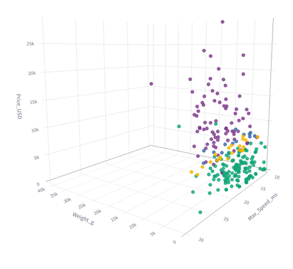

### 2. Прогнозирование реальной эффективности. Ансамблирование
Для компенсации маркетинговых искажений и прогнозирования истинного времени полёта (Actual_Flight_Time_min) предиктивное ядро системы использует два различных методологических подхода к ансамблированию решающих деревьев: **бэггинг (Random Forest) и градиентный бустинг (XGBoost)**. Это позволяет сопоставить их эффективность и выбрать наилучшую модель. В ходе валидации модель XGBoost достигла наилучшего результата со среднеквадратичной ошибкой **RMSE = 2.5 мин.** (точность ~8.9% относительно полетной миссии).

### 3. Оцифровка приоритетов и ранжирование AHP + TOPSIS
Подбор оборудования выполняется по гибридному конвейеру:
1. **AHP (Метод анализа иерархий):** пользователь заполняет обратно-симметричную матрицу парных сравнений критериев $A$ по 9-балльной шкале Саати. Модель вычисляет максимальное собственное значение $\lambda_{max}$, вектор весов критериев и строго контролирует уровень логической непротиворечивости эксперта через отношение согласованности ($CR = \frac{CI}{RI}$). Если $CR > 0.1$, система блокирует расчет и требует пересмотра суждений.
2. **TOPSIS** — строится нормализованная взвешенная матрица. Алгоритм синтезирует в $n$-мерном пространстве две виртуальные точки: Положительное Идеальное Решение ($A^+$ — лучшие ТТХ на рынке) и Отрицательное Идеальное Решение ($A^-$ — худшие ТТХ). Итоговый рейтинг вычисляется как коэффициент относительной близости к идеалу:
$$C_i^* = \frac{D_i^-}{D_i^+ + D_i^-}$$
Ранжирование осуществляется на основе скорректированных ИИ (предиктором) значений времени полета, что исключает закупку "эффективных на бумаге", но неприменимых в реальности дронов.

---

## Интерактивный дашборд Streamlit

Пользовательский интерфейс разбит на 5 функциональных вкладок, обеспечивающих сквозной аналитический конвейер:

**Вкладка 1: Данные и кластеризация**
   * Загрузка собственного датасета (CSV) или генерация синтетической выборки физической моделью.
   * Обзор загруженных данных до и после предобработки
   * Интерактивная настройка параметров HDBSCAN (`min_cluster_size`), возможность автоподбора параметров.
   * Отображение интерактивного 3D-графика проекции кластеров.
   * Вывод стастистики по полученным кластерам
   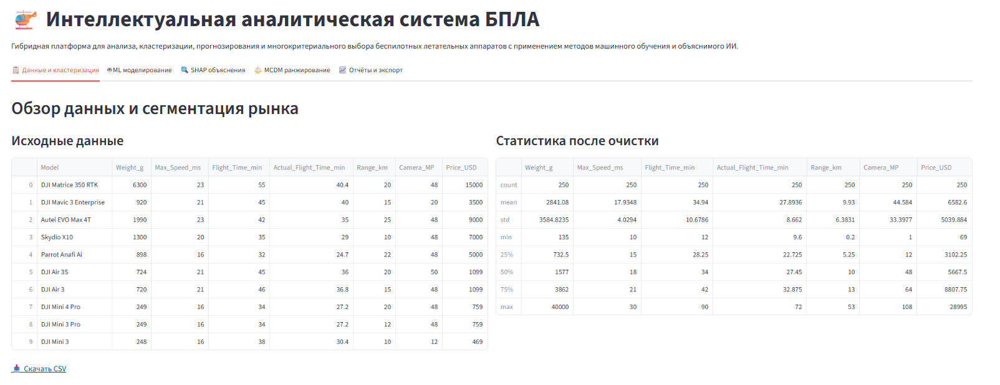
   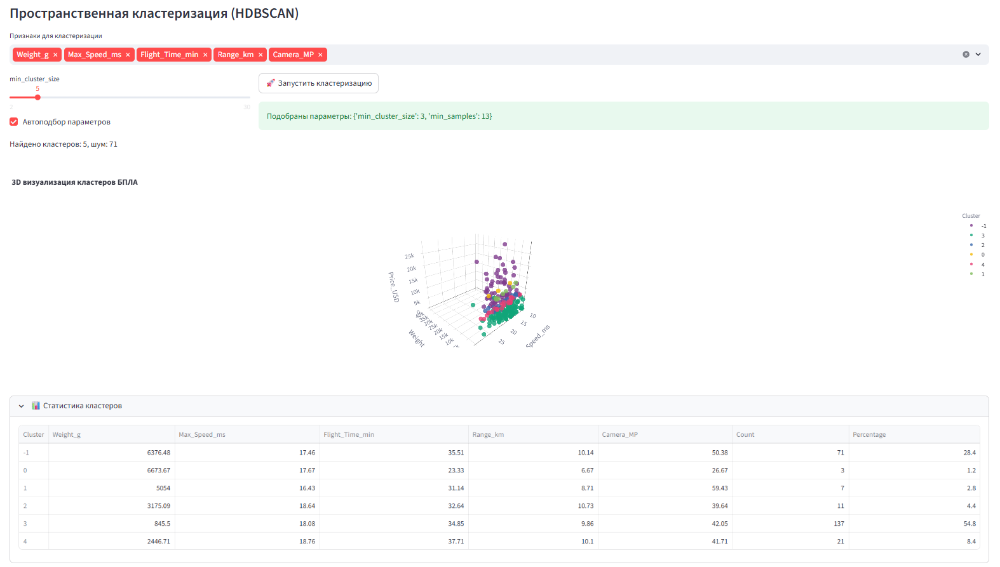
   
**Вкладка 2: ML моделирование** 
   * Выбор алгоритма (Random Forest / XGBoost) и обучение модели в реальном времени.
   * Вывод метрик регрессии (RMSE, MAE, $R^2$, MAPE) и сравнительного графика предсказанного против фактического времени.
   * Вывод важности признаков.
   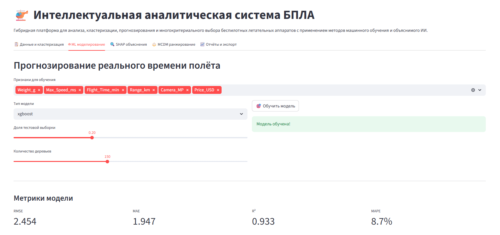
   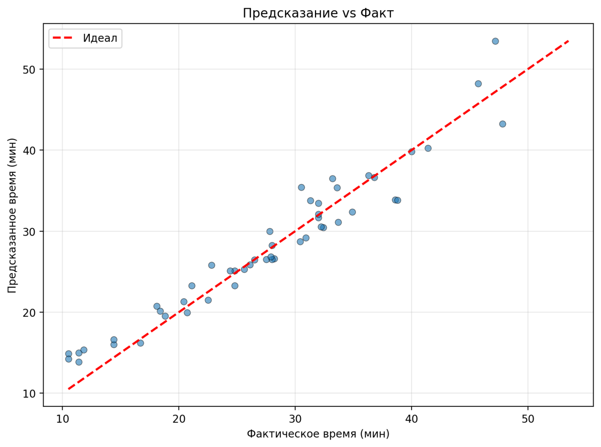
   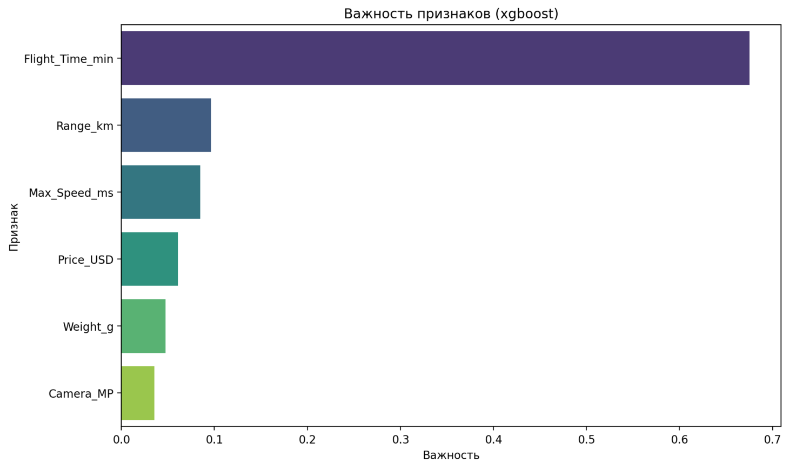

**Вкладка 3: SHAP объяснения**
   * Макроанализ: график beeswarm-распределения глобальной важности признаков.
   * Микроанализ: генерация индивидуальной каскадной диаграммы (Waterfall Plot) для выбранной модели БПЛА, график наглядно интерпретирует, почему ИИ скорректировал базовое время полета (какой вклад внесла избыточная масса и другие физические параметры дрона).
   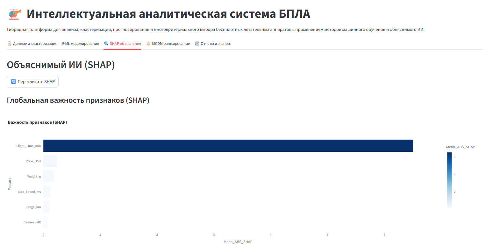
   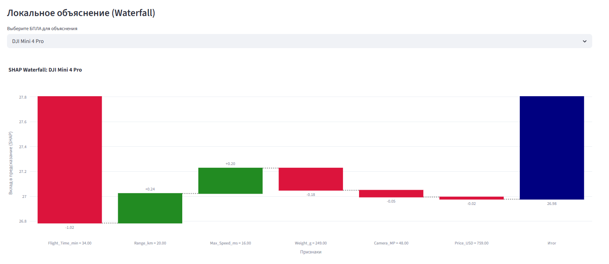
   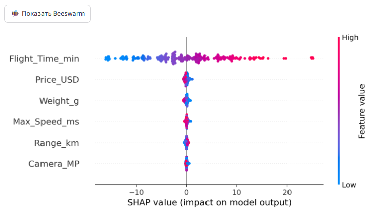
   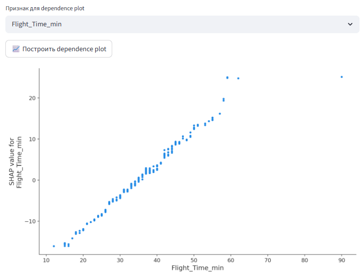

**Вкладка 4: MCDM ранжирование**
   * Возможность использовать предсказанное время вместо исходного табличного для формирования рейтинга.
   * Подбор критериев для MCDM и их весов (в методе AHP).
   * Расчет весов, проверка $CR$ и вывод итогового ТОП рейтинга БПЛА, рекомендованных к закупке.
   * Вывод интерактивного графика ТОП.
   * Возможность выгрузки сформированного рейтинга для удобства пользователя.
   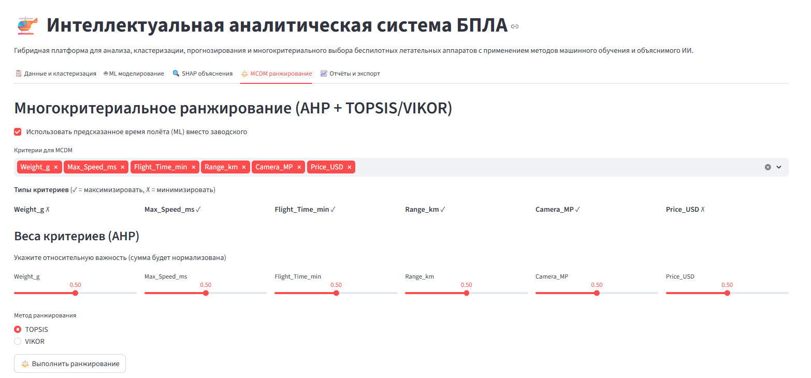
   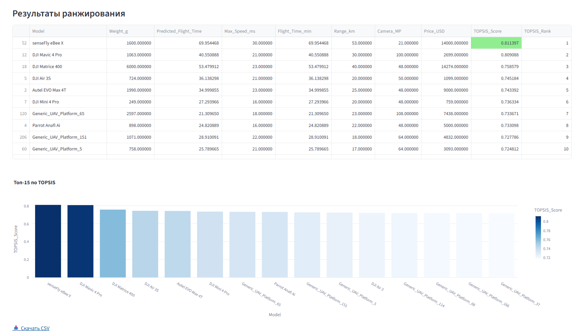

**Вкладка 5: Отчёты и экспорт**
   * Экспорт обработанных данных.
   * Матрица корреляции.
   * Генерация и экспорт текстового отчёта для аналитиков и закупщиков.
   * Сводка о системе.
   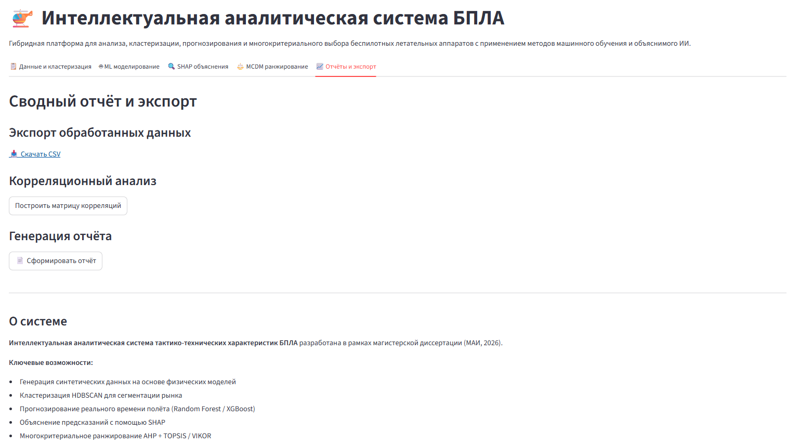

---

## Группы пользователей

Продукт ориентирован на три ключевые группы пользователей:
* **Специалисты по закупкам и менеджеры:** автоматизация рутинного сбора спецификаций. Сокращение времени на проведение комплексного технико-экономического анализа рынка с нескольких недель до считанных минут. Минимизация рисков нецелевого расходования бюджета при закупке дорогостоящего оборудования.
* **Главные инженеры и аналитики:** получение доверенных, математически обоснованных экспертных рекомендаций. Выявление скрытых нелинейных зависимостей ТТХ оборудования.
* **Операторы беспилотных миссий:** точное предиктивное планирование безопасного времени полета с учетом конкретных погодных условий.

---

## Инструкция по развертыванию и запуску

### Требования к окружению
* Язык программирования: **Python 3.10+**
* Операционная система: Windows 10/11, macOS, Linux

### 1. Клонирование репозитория
```bash
git clone [https://github.com/TurboBrumbo/MAI_Masters_thesis_2026.git](https://github.com/TurboBrumbo/MAI_Masters_thesis_2026.git)
cd MAI_Masters_thesis_2026
```

### 2. Создание и активация виртуального окружения (рекомендуется)
```bash
python -m venv venv
# Для Windows:
venv\Scripts\activate
# Для macOS/Linux:
source venv/bin/activate
```

### 3. Установка зависимостей
```bash
pip install -r requirements.txt
```

### 4. Запуск аналитической системы
```bash
streamlit run app.py
```

*После запуска веб-интерфейс автоматически откроется в вашем браузере по адресу http://localhost:8501*
